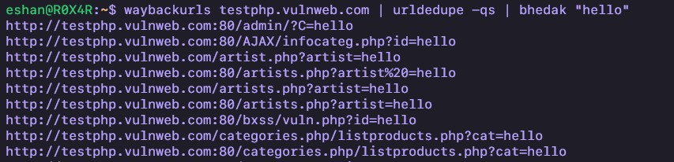
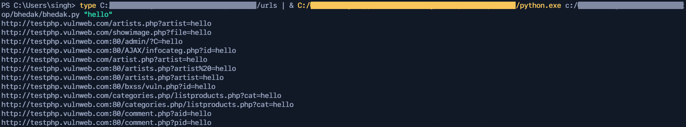
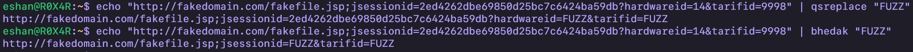

<p align="center">

</p>
<h1 align="center">
<b>Bhedak</b>
</h2>

A replacement of [`qsreplace`](https://github.com/tomnomnom/qsreplace), accepts URLs as standard input, replaces all query string values with user-supplied values and stdout. Works on every `OS`. Made with `python`<br/>

<h3><b>Installation</b></h3><br/>

```bash
$ wget -O bhedak https://raw.githubusercontent.com/R0X4R/bhedak/main/bhedak.py -q && chmod +x bhedak && mv bhedak /usr/bin/
```

<h3><b>Usage</b></h3><br/>

- **For `linux`, `unix` and `debian` based systems**

    

    ```bash
    $ waybackurls target.tld | bhedak "payload"
    ```

- **For `windows` based systems**

    

    ```css
    cmd> type urls.txt | python bhedak.py "payload"
    ```

- **If no `payload` passed**

    ```bash
    $ waybackurls subdomain.target.tld | bhedak
    
    http://subdomain.target.tld/comment.php?pid=FUZZ&user=FUZZ
    http://subdomain.target.tld/disclaimer.php=FUZZ
    http://subdomain.target.tld/hpp/index.php?pp=FUZZ
    http://subdomain.target.tld/hpp/?pp=FUZZ&user=FUZZ
    ```

- **Example input file**
    
    ```bash
    $ waybackurls subdomain.target.tld | tee -a urls

    http://subdomain.target.tld/comment.php?pid=username&user=1
    http://subdomain.target.tld/disclaimer.php=1
    http://subdomain.target.tld/hpp/index.php?pp=12
    http://subdomain.target.tld/hpp/?pp=12&user=5
    ```

- **Replace query string values**

    ```bash
    $ cat urls | bhedak "FUZZ"

    http://subdomain.target.tld/comment.php?pid=FUZZ&user=FUZZ
    http://subdomain.target.tld/disclaimer.php=FUZZ
    http://subdomain.target.tld/hpp/index.php?pp=FUZZ
    http://subdomain.target.tld/hpp/?pp=FUZZ&user=FUZZ
    ```

- **Replace query string with custom payloads**

    ```bash
    $ cat urls | bhedak "\"><svg/onload=alert(1)>*'/---+{{7*7}}"

    http://subdomain.target.tld/comment.php?pid=%22%3E%3Csvg%2Fonload%3Dalert%281%29%3E%2A%27%2F---%2B%7B%7B7%2A7%7D%7D&user=%22%3E%3Csvg%2Fonload%3Dalert%281%29%3E%2A%27%2F---%2B%7B%7B7%2A7%7D%7D
    http://subdomain.target.tld/disclaimer.php=%22%3E%3Csvg%2Fonload%3Dalert%281%29%3E%2A%27%2F---%2B%7B%7B7%2A7%7D%7D
    http://subdomain.target.tld/hpp/index.php?pp=%22%3E%3Csvg%2Fonload%3Dalert%281%29%3E%2A%27%2F---%2B%7B%7B7%2A7%7D%7D
    http://subdomain.target.tld/hpp/?pp=%22%3E%3Csvg%2Fonload%3Dalert%281%29%3E%2A%27%2F---%2B%7B%7B7%2A7%7D%7D&user=%22%3E%3Csvg%2Fonload%3Dalert%281%29%3E%2A%27%2F---%2B%7B%7B7%2A7%7D%7D
    ```
- **Remove duplicate urls**

    ```bash
    $ cat urls | bhedak "FUZZ" | sort -u

    http://subdomain.target.tld/comment.php?pid=FUZZ&user=FUZZ
    http://subdomain.target.tld/disclaimer.php=FUZZ
    http://subdomain.target.tld/hpp/index.php?pp=FUZZ
    http://subdomain.target.tld/hpp/?pp=FUZZ&user=FUZZ
    ```
- **Comparsion**


    <br/><br/>


    ```bash
    $ echo "http://fakedomain.com/fakefile.jsp;jsessionid=2ed4262dbe69850d25bc7c6424ba59db?hardwareid=14&tarifid=9998" | qsreplace "FUZZ"
    http://fakedomain.com/fakefile.jsp;jsessionid=2ed4262dbe69850d25bc7c6424ba59db?hardwareid=FUZZ&tarifid=FUZZ
    
    $ echo "http://fakedomain.com/fakefile.jsp;jsessionid=2ed4262dbe69850d25bc7c6424ba59db?hardwareid=14&tarifid=9998" | bhedak "FUZZ"
    http://fakedomain.com/fakefile.jsp;jsessionid=FUZZ?hardwareid=FUZZ&tarifid=FUZZ
    ```

<h3><b>Donate</b></h3>
If this tool helped you or you like my work<br/>

</br><a href="https://rzp.io/l/pQny7s0n"></a>    <a href="https://ko-fi.com/i/IK3K34SJSA"></a><br/><br/>

---

Thanks to [`@tomnomnom`](https://github.com/tomnomnom) for making an amazing tool called [`qsreplace`](https://github.com/tomnomnom/qsreplace), from using [`qsreplace`](https://github.com/tomnomnom/qsreplace) I got idea to make [`bhedak`](https://github.com/R0X4R/bhedak)